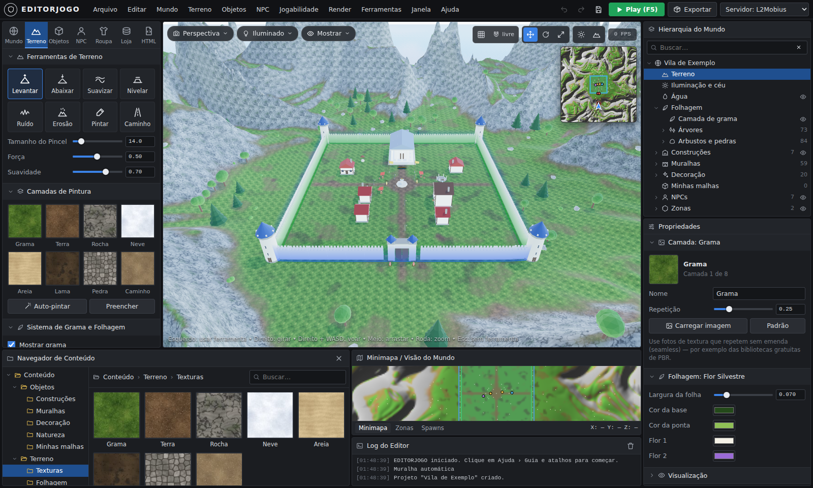

# EditorJogo — editor de mundo estilo Lineage 2 + Unreal Engine 5

Um editor que roda no navegador, com cara de engine profissional, que junta o que era fácil no
UnrealEd 2 do Lineage 2 (montar cidade clicando no chão, multisell, HTML dos NPCs) com o que o UE5
tem de bonito (malhas importadas, física de roupa e capa, paisagem com montanhas, grama que balança,
texturas, céu com nuvens) — sem a complicação do UE5.

Tudo que você faz aqui vira **arquivos prontos para o servidor** (L2Mobius / L2J) e um **pacote para
o Unreal Engine 5** (Landscape + malhas + script Python que monta a fase).



## Como abrir

**Jeito fácil:** baixe o arquivo [`dist/EditorJogo.html`](dist/EditorJogo.html) e abra com duplo
clique no Chrome ou no Edge. É um arquivo só, funciona sem internet e sem instalar nada.

**Para desenvolver** (precisa do [Node.js](https://nodejs.org) 18+):

```bash
npm install
npm run dev      # abre em http://localhost:8080/EditorJogo.html e recompila ao salvar
npm run build    # gera dist/EditorJogo.html
npm test         # testes de unidade (XML, bypass, PNG 16 bits, ZIP, coordenadas)
npm run smoke    # teste completo no navegador (precisa do Playwright)
```

## O que tem em cada aba

| Aba | O que faz |
|---|---|
| **Mundo** | Hora do dia (amanhecer, meio-dia, pôr do sol, noite com estrelas), direção do sol, nuvens animadas, névoa, vento, água. |
| **Terreno** | Levantar, Abaixar, Suavizar, Nivelar, Ruído, **Erosão**, Pintar e **Caminho** (aplaina e pinta estrada). 8 camadas de textura (Grama, Terra, Rocha, Neve, Areia, Lama, Pedra, Caminho) — dá para trocar qualquer uma por uma foto sua. Gerar montanhas/vale/colinas/ilha com área plana para a cidade, auto-pintar, importar heightmap (PNG ou RAW 16 bits). **Grama e folhagem** com vento e flores (Grama Curta, Grama Alta, Flor Silvestre, Campo Florido, Floresta, Capim Seco). |
| **Objetos** | Escolha a peça no **Navegador de Conteúdo** (miniaturas 3D) e clique no chão. Gizmo W/E/R como no Unreal, grade/ímã, **muralha automática** com torres, **espalhar** árvores e pedras com pincel, **importar suas malhas** GLB/FBX/OBJ. Bandeiras com tecido de verdade balançando no vento. |
| **NPC** | Coloca NPCs (viram spawns do servidor) com **Posição e Heading em coordenadas L2**, Level, HP, MP, raça, **IA** (agressivo, raio de visão), respawn, quantidade/raio, **Drop List**, página HTML e loja. Desenha **zonas** (paz, cidade, arena PvP...). |
| **Roupa** | **Física de tecido**: capa (presa nos ombros), manto/saia (na cintura) e bandeira. Rigidez, dobra, peso, vento, colisão com o corpo, formato da ponta (reta, V, pontas, rasgada), cores e **emblema**. Testa num boneco andando/correndo — ou no seu personagem GLB/FBX (ex.: Mixamo) escolhendo o osso. |
| **Loja** | Multisell com prévia igual à janela do jogo, IDs de item com nome, colar lista "id;quantidade;preço", importar XML existente, importar a lista de itens do seu servidor. |
| **HTML** | Diálogos dos NPCs com trechos prontos (link de chat, multisell, teleporte, botão, tabela...) e **prévia navegável no estilo L2** — clique nos links para ir de página em página e abrir as lojas. |
| **Play (F5)** | Anda pelo mapa em terceira pessoa (WASD, Shift corre, Espaço pula) **com a capa simulada**; chegue perto de um NPC e aperte **E** para abrir o HTML dele e as lojas. |
| **Exportar** | Pacote do servidor e pacote do UE5, validação (links quebrados, lojas inexistentes, NPC sem página...). |

Embaixo ficam o **Navegador de Conteúdo**, o **Minimapa** (clique para ir até o ponto; mostra
coordenadas L2) e o **Log do Editor**. À direita, a **Hierarquia do Mundo** (com olho para esconder
grama, água, objetos, NPCs e zonas) e as **Propriedades** do que estiver selecionado.

## Levando para o servidor (L2Mobius / L2J)

`Exportar › Baixar pacote do servidor` gera um .zip com:

```
data/multisell/custom/<ID>.xml      lojas (os NPCs que abrem a loja pelo HTML entram em <npcs>)
data/html/<pasta>/<npcId>.htm       diálogos
data/spawns/Custom/EditorJogo_*.xml spawns (L2Mobius / L2J Server)
sql/custom_spawnlist.sql            spawns para L2J High Five antigo (tabela custom_spawnlist)
data/zones/editorjogo_*.xml         zonas (NPoly)
data/stats/npcs/custom/*.xml        NPCs novos (só os marcados como "NPC novo")
referencia/npcs.txt                 coordenadas de cada NPC para testar com //teleport
LEIA-ME.txt                         onde colocar cada arquivo
```

- O centro do terreno fica no centro do **tile** escolhido (padrão 20_18) e a escala é configurável
  (unidades L2 por metro). Veja e mude isso em **Mundo › Propriedades** ou em **Exportar**.
- Os comandos de bypass (`npc_%objectId%_Chat 1`, `_multisell`, `_goto`...) variam entre pacotes:
  mude os modelos em **Exportar › Comandos de bypass**.
- Os IDs de NPC e de itens precisam existir no seu datapack (os do exemplo são ilustrativos). Importe
  a lista de itens do servidor em **Loja › Itens conhecidos** (lê `data/stats/items/*.xml`).
- No L2Mobius ative `CustomMultisellLoad` e `CustomNpcData` quando usar as pastas `custom`.
  O formato do XML de NPC muda entre versões: compare com um NPC do seu datapack antes de usar.

## Levando para o Unreal Engine 5

`Exportar › Baixar pacote UE5` gera:

- `landscape/heightmap_<res>.png` (16 bits) e `.r16`, com as **escalas X/Y/Z exatas** no `LEIA-ME_UE5.txt`;
- `landscape/camada_<Nome>.png` — uma imagem por camada de textura (weightmaps);
- `meshes/*.glb` — todas as peças usadas (uma malha por peça) e as suas malhas importadas;
- `capas/` — a capa atual em pose de repouso (vértices presos marcados em vermelho) + valores sugeridos para o Chaos Cloth;
- `cena.json` + `importar_cena.py` — no UE5 ative o plugin **Python Editor Script Plugin** e rode
  `Tools › Execute Python Script`: ele importa as malhas e coloca todos os objetos, NPCs (Target Points)
  e zonas no lugar certo. Pode rodar de novo quantas vezes quiser.

## Atalhos

| Tecla | Ação |
|---|---|
| Botão direito + arrastar / + WASD | Girar a câmera / voar (Q desce, E sobe, Shift rápido) |
| Botão do meio / roda | Arrastar / zoom |
| Q, W, E, R | Selecionar, mover, girar, escalar |
| Delete, Ctrl+D, End, F | Apagar, duplicar, grudar no chão, focar |
| `[` `]` | Tamanho do pincel (Terreno) / girar peça (Objetos) |
| 1 a 8 | Camada de pintura |
| Ctrl+Z, Ctrl+Y, Ctrl+S | Desfazer, refazer, salvar |
| F5 | Play |

## O que ele não faz (ainda)

- **Não gera mapa para o cliente original do Lineage 2** (UE2, arquivos `.unr`): o cenário vai para o
  **UE5** (cliente novo). Os arquivos de servidor (spawns, lojas, HTML, zonas) funcionam com qualquer cliente.
- **Não gera geodata.** Sem geodata o servidor aceita o Z enviado pelo cliente; gere a geodata do mapa novo depois.
- A qualidade visual depende dos modelos e texturas: as peças prontas são simples (feitas por código).
  Importe as suas (GLB/FBX/OBJ e fotos de textura) para chegar no visual das engines grandes.
- Tudo fica no arquivo `.json` do projeto (**Salvar**). O navegador guarda um salvamento automático
  por minuto como segurança, mas não confie só nele.

## Estrutura do código

```
src/main.js            aplicação: layout, menus, painéis, câmera, loop, salvar/abrir, exportar
src/modes/             abas (mundo, terreno, objetos/npc, roupa, loja, html, exportar)
src/world/             terreno (8 camadas), grama, céu, água, texturas procedurais
src/city/              editor de cidade, peças prontas
src/cloth/             simulação de tecido, manequim, laboratório de capas
src/play/              modo Play
src/l2/                itens, multisell, HTML (prévia L2), exportação do servidor
src/ue5/               exportação UE5 (heightmap 16 bits, GLB, cena.json)
src/ui/                componentes, ícones, hierarquia, navegador de conteúdo, minimapa, log
ue5/importar_cena.py   script que monta a fase no UE5
tests/                 testes de unidade e teste no navegador
```

Feito com [three.js](https://threejs.org). Tudo roda no seu computador; nenhum arquivo é enviado para lugar nenhum.
