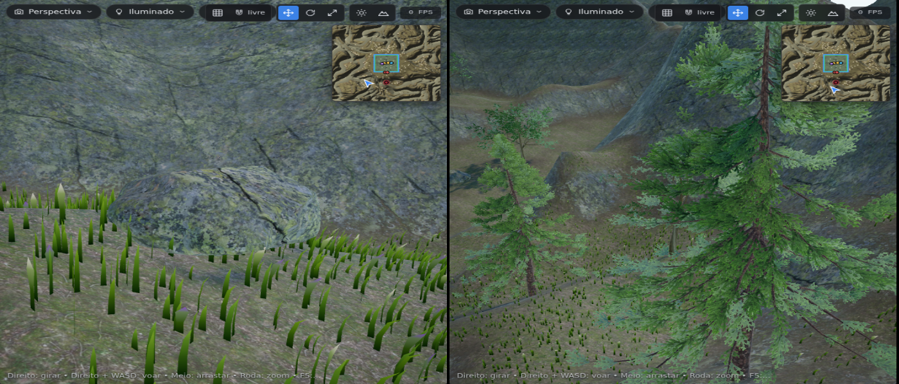
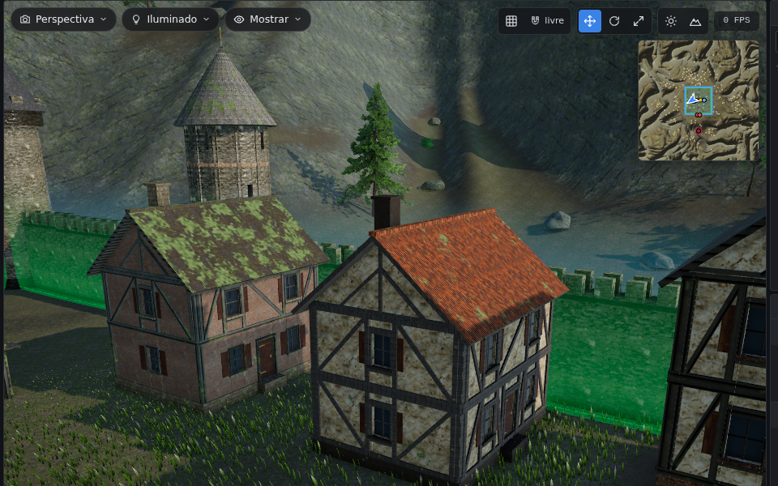
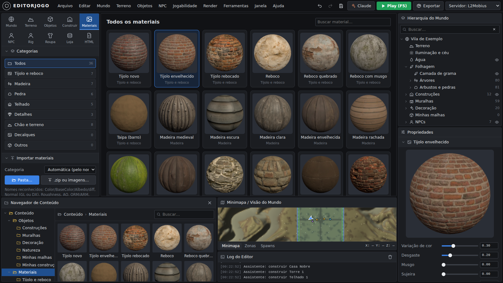

# EditorJogo — editor de mundo estilo Lineage 2

Um editor que roda no navegador, com cara de engine profissional. Ele junta o que era fácil no
UnrealEd 2 do Lineage 2 (montar cidade clicando no chão, multisell, HTML dos NPCs) com recursos que
as engines modernas como o UE5 têm (malhas importadas, física de roupa e capa, paisagem com montanhas,
grama que balança, texturas, céu com nuvens). O UE5 foi só a referência: tudo roda aqui mesmo, sem
depender de nenhuma engine.

Você monta o mundo, testa andando por ele no **modo Play** e gera os **arquivos prontos para o
servidor** (L2Mobius / L2J).

O visual é **realista, não "low poly"**: o chão, as paredes, os telhados e as pedras usam fotos
escaneadas de verdade (PBR: cor, relevo, rugosidade e oclusão), as árvores têm tronco com casca, galhos e
milhares de folhas balançando no vento, e na qualidade Alta há sombra de contato (oclusão de ambiente).




## Como abrir

**Jeito fácil:** baixe o arquivo [`dist/EditorJogo.html`](dist/EditorJogo.html) e abra com duplo
clique no Chrome ou no Edge. É um arquivo só, funciona sem internet e sem instalar nada.

**Para desenvolver** (precisa do [Node.js](https://nodejs.org) 18+):

```bash
npm install
npm run dev      # abre em http://localhost:8080/EditorJogo.html e recompila ao salvar
npm run build    # gera dist/EditorJogo.html
npm test         # testes de unidade (XML, bypass, ZIP, coordenadas, nomes de textura)
npm run smoke    # teste completo no navegador (precisa do Playwright)
```

## O que tem em cada aba

| Aba | O que faz |
|---|---|
| **Mundo** | Hora do dia (amanhecer, meio-dia, pôr do sol, noite com estrelas), direção do sol, nuvens animadas, névoa, vento, água. |
| **Terreno** | Levantar, Abaixar, Suavizar, Nivelar, Ruído, **Erosão**, Pintar e **Caminho** (aplaina e pinta estrada). 8 camadas de textura (Grama, Terra, Rocha, Neve, Areia, Lama, Pedra, Caminho) já com **fotos PBR** (cor, normal, rugosidade e AO), misturadas por altura (as pedras "saltam" da grama) — e dá para trocar por qualquer outra, veja [Texturas realistas](#texturas-realistas). Gerar montanhas/vale/colinas/ilha com área plana para a cidade, auto-pintar, importar heightmap (PNG ou RAW 16 bits). **Grama e folhagem** com vento: 15 tipos (Grama Curta, Alta, Flor Silvestre, Campo Florido, Floresta, Capim Seco, Pasto, **Trigo** com espigas, **Juncos** de beira d'água, Trevo, Alpina, Outono, **Lavanda**, Pântano, Capim Dourado) e você escolhe em quais camadas ela nasce (ex.: juncos na Lama). |
| **Objetos** | Escolha a peça no **Navegador de Conteúdo** (miniaturas 3D) e clique no chão. Casas em enxaimel com reboco, madeira e telha de barro, torres de pedra com telhado de ardósia, templo de mármore, **árvores realistas** (carvalho, freixo, pinheiro, arbustos — cada cópia varia) e pedras lascadas. Gizmo W/E/R, grade/ímã, **muralha automática** com torres, **espalhar** árvores e pedras com pincel, **importar suas malhas** GLB/GLTF/FBX/OBJ **junto com as texturas** (arquivos soltos, pasta ou .zip; veja [Malhas com texturas](#malhas-com-texturas)). Bandeiras com tecido de verdade balançando no vento. |
| **Construir** | O **Construtor**: casa, castelo, muros, torre, portão, telhado e ponte **sem Blender** — clique nos cantos no chão e as paredes, portas, janelas, enxaimel, base de pedra e o telhado aparecem. Material por parte, presets A/B/C, musgo, sujeira, umidade, desgaste e reboco caindo. Veja [Construtor](#construtor-casas-sem-blender). |
| **Materiais** | Biblioteca PBR com esferas de prévia e filtro por categoria (tijolo e reboco, madeira, pedra, telhado, detalhes, chão, decalques). 36 materiais prontos e **importação de pasta/.zip** com 3 a 5 mapas por material. Veja [Materiais](#materiais-3-a-5-mapas). |
| **NPC** | Coloca NPCs (viram spawns do servidor) com **Posição e Heading em coordenadas L2**, Level, HP, MP, raça, **IA** (agressivo, raio de visão), respawn, quantidade/raio, **Drop List**, página HTML e loja. Desenha **zonas** (paz, cidade, arena PvP...). |
| **Roupa** | **Física de tecido**: capa (presa nos ombros), manto/saia (na cintura) e bandeira. Rigidez, dobra, peso, vento, colisão com o corpo, formato da ponta (reta, V, pontas, rasgada), cores e **emblema**. Testa num boneco andando/correndo — ou no seu personagem GLB/FBX (ex.: Mixamo) escolhendo o osso. |
| **Rig** | Personagens com o nosso esqueleto: boneco padrão, **rig automático** para modelos parados (malhas de IA), importar PSK/PSA do Lineage 2 e FBX/GLB, **copiar animações** de um personagem ou pacote para outro (retarget), usar nos NPCs e no Play. |
| **Loja** | Multisell com prévia igual à janela do jogo, IDs de item com nome, colar lista "id;quantidade;preço", importar XML existente, importar a lista de itens do seu servidor. |
| **HTML** | Diálogos dos NPCs com trechos prontos (link de chat, multisell, teleporte, botão, tabela...) e **prévia navegável no estilo L2** — clique nos links para ir de página em página e abrir as lojas. |
| **Play (F5)** | Anda pelo mapa em terceira pessoa (WASD, Shift corre, Espaço pula) **com a capa simulada**; chegue perto de um NPC e aperte **E** para abrir o HTML dele e as lojas. |
| **Exportar** | Pacote com os arquivos do servidor e validação (links quebrados, lojas inexistentes, NPC sem página...). |

No alto, o botão **Claude** abre o [assistente](#assistente-claude): você pede em português ("faça uma vila de
pescadores na beira do lago") e ele monta no editor.

Embaixo ficam o **Navegador de Conteúdo**, o **Minimapa** (clique para ir até o ponto; mostra
coordenadas L2) e o **Log do Editor**. À direita, a **Hierarquia do Mundo** (com olho para esconder
grama, água, objetos, NPCs e zonas) e as **Propriedades** do que estiver selecionado.

## Texturas realistas

Cada camada do terreno usa um conjunto PBR: **cor**, **normal** (relevo), **rugosidade** e **oclusão (AO)**.
As 8 camadas já vêm com fotos do [Poly Haven](https://polyhaven.com) (CC0, domínio público — lista em
[assets/textures/CREDITOS.md](assets/textures/CREDITOS.md)). Para trocar, em **Terreno › Propriedades**
clique em *Carregar textura PBR* e escolha:

- o **.zip** baixado de [Poly Haven](https://polyhaven.com/textures) ou [ambientCG](https://ambientcg.com) — os dois são
  **CC0** (grátis para qualquer uso, inclusive servidor comercial) e têm a mesma qualidade fotoescaneada das Megascans; ou
- as imagens soltas do conjunto (PNG, JPG, WEBP ou **TGA**).

O editor reconhece os mapas pelo nome do arquivo (`_diff`/`_Color`/`_Albedo`/`_D`, `_nor_gl`/`_NormalGL`/`_N`,
`_rough`/`_Roughness`, `_ao`, `_arm`/`_ORM`) e ignora altura, metal e prévias. Camadas sem mapa normal ganham um
relevo gerado a partir da cor. Tudo é reduzido para no máximo 1024 px e fica guardado no projeto.

**E as texturas do Unreal?** O Starter Content e os assets do Fab/Megascans com licença *UE-Only* só podem ser usados
dentro de projetos do Unreal Engine; levar para outro sistema quebra a licença. Assets do Fab com a licença
*Standard* podem ser usados fora do Unreal — nesse caso, no UE clique com o botão direito na textura ›
*Asset Actions › Export* e carregue aqui (as normais do Unreal são padrão **DirectX**: o editor detecta pelo nome
`T_..._N`, ou marque a opção na camada).

## Construtor (casas sem Blender)

Aba **Construir**: escolha o tipo e clique no chão.



| Tipo | Como marcar | O que sai |
|---|---|---|
| **Casa** | Os cantos (o **1º lado é a frente**, com a porta). 2 cliques = retângulo com a *Largura* do painel | Base de pedra, paredes com porta e janelas (moldura, vidro, venezianas), **enxaimel** (pilares, vigas e mãos-francesas), andares, telhado de duas ou quatro águas (ou plano/ameias; em formas que não são retângulo, telhado em tenda), oitões, chaminé |
| **Castelo** | Os cantos da muralha | Muralha com ameias e passarela, torres nos cantos, portão com grade levadiça no 1º lado, torre de menagem no meio |
| **Muros** | A linha do muro (Enter termina) | Muro grosso com ameias, sapata de pedra e torres opcionais |
| **Torre** | O centro e um ponto na borda (raio) | Torre redonda com andares, seteiras, porta e telhado cônico ou ameias |
| **Portão** | Os dois lados da passagem | Duas torres, arco, portas de madeira e grade de ferro |
| **Telhado** | Os cantos da área | Alpendre/mercado: telhado sobre pilares de madeira |
| **Ponte** | As duas margens | Ponte de pedra com **arcos** e parapeito (ou de madeira sobre estacas), seguindo o chão até as margens |

- **Parâmetros:** andares, altura do andar, espessura, largura, inclinação do telhado, beiral, enxaimel, pilares,
  janelas, porta, venezianas, chaminé, altura, ameias, torres, arcos, extensão (pelos cliques), **colisão** no Play
  (as paredes bloqueiam o personagem e dá para andar sobre a ponte) e **LOD** (versão leve de longe).
  **Auto UV:** as texturas ficam em metros reais e contínuas de uma parede para a outra (tijolos alinhados em volta das janelas).
- **Material por parte:** parede (preenchimento), madeira (estrutura), base/fundação, telhado, porta e janelas, ferragens.
  Clique numa parte e depois num material do Navegador de Conteúdo. Parede e base podem **misturar** com um 2º material
  (reboco caindo e mostrando o tijolo).
- **Presets:** **A — Simples** (tijolo envelhecido, madeira escura, pedra bruta, telha velha), **B — Rebocada**
  (reboco com tijolo aparecendo, madeira envelhecida, pedra talhada, telha cerâmica), **C — Nobre** (térreo de alvenaria
  pesada, reboco claro com madeira escura, ardósia).
- **Envelhecimento:** variação de cor, desgaste, musgo (cresce virado para cima, perto do chão e nas frestas), sujeira
  embaixo, umidade, dano no reboco, profundidade do rejunte, força da normal e altura/parallax (relevo de verdade de perto).
- **Variação:** deslocamento e giro da textura por construção e *Nova variação* (outra semente: manchas, musgo e enxaimel mudam).
- Cada construção pode ter várias **cópias** no mundo (Conteúdo › Objetos › Minhas construções); *Separar* transforma
  uma cópia numa construção própria. **Converter em malha** gera um .glb com as texturas (para outro programa ou como malha comum).

## Materiais (3 a 5 mapas)



A aba **Materiais** mostra a biblioteca como esferas, por categoria. Os 28 materiais de construção embutidos são fotos
do [Poly Haven](https://polyhaven.com) (CC0) com cor, normal e um mapa que junta **oclusão, rugosidade e altura** —
tijolo novo/envelhecido/rebocado, reboco, reboco quebrado, reboco com musgo, taipa, madeira medieval/escura/clara/
envelhecida/rachada/úmida, toras, pedra de castelo/bruta/talhada/com musgo, alvenaria pesada, bloco antigo, telha
cerâmica/velha, ardósia, shingle de madeira, palha, porta de madeira, ferro enferrujado e tecido/corda — mais as 8 do terreno.

**Importar:** *Pasta…* ou *.zip ou imagens…*. Cada subpasta (ou cada nome base, numa pasta com vários) vira um material.
Nomes reconhecidos (em inglês ou português): `Color/BaseColor/Albedo/diff/Cor`, `Normal` (GL ou DX, `_N` do Unreal),
`Roughness/Rugosidade`, `AO/Oclusao`, `ORM/ARM`, `Height/Displacement/Altura` e `Metal/Metallic`. Ex.:

```
Materiais/
  Tijolo_Porao/  Tijolo_Porao_BaseColor.jpg  Tijolo_Porao_Normal.jpg  Tijolo_Porao_Roughness.jpg  Tijolo_Porao_Height.jpg
  Telha_Nova/    T_TelhaNova_D.png  T_TelhaNova_N.png  T_TelhaNova_ORM.png
```

No painel do material dá para ajustar o tamanho real (metros por repetição), tinta, rugosidade, metal, força da normal
e profundidade do relevo, trocar um mapa, **aplicar numa camada do terreno** ou usar em qualquer parte do Construtor.

## Malhas com texturas

Em **Objetos › Importar malha** mande o modelo **junto com as texturas** — arquivos soltos, a **pasta** inteira ou um .zip:

- **GLB**: as texturas já vêm dentro.
- **GLTF**: o `.gltf` + o `.bin` + as imagens.
- **OBJ**: o `.obj` + o `.mtl` + as imagens (o caminho escrito no .mtl pode ser de outra pasta: o editor acha pelo nome).
- **FBX**: o `.fbx` + as imagens (inclusive `.tga`).

As imagens ficam guardadas no projeto. Se o modelo não disser qual textura usar, o editor **liga pelo nome**: o
material `Parede` recebe `parede_color.png`, `parede_normal.png`, `parede_roughness.png`…; se a pasta tiver um conjunto
só, ele vai para os materiais sem textura. Para uma malha já importada, selecione e use *Adicionar texturas…*.

## Assistente Claude

O botão **Claude** (no alto) abre o painel do assistente. Ele conversa em português e **mexe no editor**: gera e pinta
terreno, coloca peças e natureza, constrói casas/castelos/pontes no Construtor, cria NPCs com loja e diálogo, zonas,
grama, céu, tira foto da tela para ver o resultado e **analisa o que falta no mundo e no programa**. Tudo o que ele faz
entra no histórico: **Ctrl+Z desfaz**. Com *Permitir scripts* ligado ele pode rodar código no editor (controle total).

Três jeitos de ligar:

1. **No claude.ai** (o link do artifact): usa a sua conta, sem chave. Na primeira mensagem o claude.ai pede permissão.
2. **Chave da API** (editor aberto no seu computador): em *configurar* coloque a chave de
   [console.anthropic.com](https://console.anthropic.com) (fica só no seu navegador). Usa o modelo `claude-opus-5`
   com raciocínio adaptativo e com *fallbacks* do servidor ligados (`server-side-fallback-2026-07-01`): se o modelo
   recusar um pedido, a API tenta o modelo recomendado no mesmo pedido. Dá para trocar o modelo no mesmo lugar.
3. **Claude Code no seu PC** (o mais completo: também lê seus arquivos e importa pastas de modelos e texturas).
   Com o [Node.js](https://nodejs.org) 18+ e o [Claude Code](https://claude.com/claude-code) instalados, na pasta do seu jogo:

   ```bat
   cd "C:\Users\phala\Documents\AGE OF VERDANT"
   git clone https://github.com/phalanjunio-stack/Editorjogo.git
   claude mcp add editorjogo -- node "C:\Users\phala\Documents\AGE OF VERDANT\Editorjogo\tools\mcp.mjs"
   claude
   ```

   Peça por exemplo: *"abra o editor e importe a pasta Modelos\Casas com as texturas"* ou *"monte uma vila com 8 casas
   preset B perto do lago"*. A ponte abre o editor em `http://127.0.0.1:8777` e o Claude Code controla a página aberta
   (o painel mostra cada ação). Para usar outro arquivo do editor: `node tools/mcp.mjs --html "C:\...\EditorJogo.html"`.

## Levando para o servidor (L2Mobius / L2J)

`Exportar › Baixar pacote do servidor` gera um .zip com:

```
data/multisell/custom/<ID>.xml      lojas (os NPCs que abrem a loja pelo HTML entram em <npcs>)
data/html/<pasta>/<npcId>.htm       diálogos
data/spawns/Custom/EditorJogo_*.xml spawns (L2Mobius / L2J Server)
sql/custom_spawnlist.sql            spawns para L2J High Five antigo (tabela custom_spawnlist)
data/zones/editorjogo_*.xml         zonas (NPoly)
data/stats/npcs/custom/*.xml        NPCs novos (só os marcados como "NPC novo")
referencia/npcs.txt                 coordenadas de cada NPC para testar com //teleport
LEIA-ME.txt                         onde colocar cada arquivo
```

- O centro do terreno fica no centro do **tile** escolhido (padrão 20_18) e a escala é configurável
  (unidades L2 por metro). Veja e mude isso em **Mundo › Propriedades** ou em **Exportar**.
- Os comandos de bypass (`npc_%objectId%_Chat 1`, `_multisell`, `_goto`...) variam entre pacotes:
  mude os modelos em **Exportar › Comandos de bypass**.
- Os IDs de NPC e de itens precisam existir no seu datapack (os do exemplo são ilustrativos). Importe
  a lista de itens do servidor em **Loja › Itens conhecidos** (lê `data/stats/items/*.xml`).
- No L2Mobius ative `CustomMultisellLoad` e `CustomNpcData` quando usar as pastas `custom`.
  O formato do XML de NPC muda entre versões: compare com um NPC do seu datapack antes de usar.

## Atalhos

| Tecla | Ação |
|---|---|
| Botão direito + arrastar / + WASD | Girar a câmera / voar (Q desce, E sobe, Shift rápido) |
| Botão do meio / roda | Arrastar / zoom |
| Q, W, E, R | Selecionar, mover, girar, escalar |
| Delete, Ctrl+D, End, F | Apagar, duplicar, grudar no chão, focar |
| `[` `]` | Tamanho do pincel (Terreno) / girar peça (Objetos) |
| 1 a 8 | Camada de pintura |
| Ctrl+Z, Ctrl+Y, Ctrl+S | Desfazer, refazer, salvar |
| F5 | Play |

## O que ele não faz (ainda)

- **Não gera mapa para o cliente original do Lineage 2** (UE2, arquivos `.unr`): o cenário (terreno,
  construções, grama) fica no projeto do EditorJogo e no modo Play. Os arquivos de servidor (spawns,
  lojas, HTML, zonas) funcionam com qualquer cliente.
- **Não gera geodata.** Sem geodata o servidor aceita o Z enviado pelo cliente; gere a geodata do mapa novo depois.
- O Construtor faz casas, castelos, muros, torres, portões, telhados e pontes; interiores (móveis, escadas, andares
  por dentro) e formas muito livres (catedral, domo) ainda pedem um modelo seu em GLB/FBX/OBJ.
- Terreno é um mapa de altura só (sem cavernas) e a água é um plano (sem rios com correnteza).
- Sem editor de quests, itens, skills ou classes, e sem som.
- Tudo fica no arquivo `.json` do projeto (**Salvar**). O navegador guarda um salvamento automático
  por minuto como segurança, mas não confie só nele.

## Estrutura do código

```
src/main.js            aplicação: layout, menus, painéis, câmera, loop, salvar/abrir, exportar
src/modes/             abas (mundo, terreno, objetos/npc, construtor, materiais, rig, roupa, loja, html, exportar)
src/build/             Construtor: geometria (paredes com aberturas, enxaimel, telhados, torres, ponte com arcos)
src/materials/         biblioteca de materiais PBR e o shader de envelhecimento (musgo, sujeira, umidade, parallax)
src/ai/                assistente Claude: ferramentas do editor, painel de conversa e canais
tools/mcp.mjs          ponte MCP para o Claude Code (serve o editor em 127.0.0.1:8777)
src/rig/               personagens: esqueleto padrão, PSK/PSA, retarget de animações e rig automático
src/world/             terreno (8 camadas PBR em texture arrays), grama, céu, água, pós-processamento
src/city/              editor de cidade, peças prontas (materiais PBR, pedras), malhas com texturas
src/nature/            árvores realistas (ez-tree) com vento
src/assets.js          texturas embutidas (assets/textures: fotos em WebP 512 px)
src/cloth/             simulação de tecido, manequim, laboratório de capas
src/play/              modo Play
src/l2/                itens, multisell, HTML (prévia L2), exportação do servidor
src/ui/                componentes, ícones, hierarquia, navegador de conteúdo, minimapa, log
tests/                 testes de unidade e teste no navegador
```

Feito com [three.js](https://threejs.org) e [ez-tree](https://github.com/dgreenheck/ez-tree) (ambos MIT).
Texturas: Poly Haven (CC0) e ez-tree. Tudo roda no seu computador; nenhum arquivo é enviado para lugar nenhum.

**Qualidade gráfica** (menu Render): *Alta* liga sombra de contato, sombras 2048 e densidade de pixels 2×;
*Média* tem antisserrilhado e sombras; *Baixa* é para notebook fraco (sem sombras nem pós-processamento).
